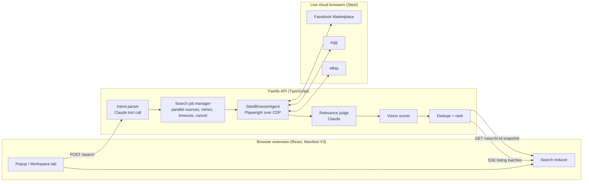

<div align="center">

# 🔭 Scout

### Search once. Let the web agents do the tab-switching.

**A browser extension that turns one plain-English request into parallel browser agents searching Facebook Marketplace, Kijiji, and eBay, then merges everything into a single ranked feed.**

[](https://www.typescriptlang.org/)
[](apps/extension)
[](https://steel.dev)
[](https://www.anthropic.com)
[](#quality)

*Battle of the Schools · Web Agents track*

</div>

---

## The problem

Buying secondhand is fragmented. Someone looking for *"used dumbbells under $50 near Kensington Market"* opens Facebook Marketplace, then Kijiji, then eBay, retypes the search, re-applies filters, and compares listings that describe the same thing three different ways. Marketplaces do not offer public search APIs, and hand-written scrapers break the week a site redesigns.

## The solution

Scout is a Chromium extension backed by a small TypeScript API. You type what you want and tick the marketplaces. Scout parses your intent with Claude, launches one real cloud browser per marketplace, navigates each site the way a person would, and streams normalized listings back into a single feed as they arrive. A second Claude pass reads every candidate card and decides whether it is a plausible match, so an automotive part called "housing" never shows up in a search for a place to live.

Every agent session is a **live, watchable browser**. Click **Watch live** in the activity panel and you can see the agent scroll Kijiji in real time.

<p align="center"><em>One search box. Three marketplaces. One ranked feed, streaming in as agents finish.</em></p>

---

## What judges will see

```text
"housing near uoft"  +  ☑ Facebook Marketplace  ☑ Kijiji  ☑ eBay
        │
        ▼
 Intent parser (Claude tool call)  ──►  { item: "housing", location: "University of Toronto", searchMode: "housing" }
        │
        ▼
 Three Steel browser sessions launch in parallel   ◄── Watch live ↗
        │  Facebook needs sign-in?  →  "Open sign-in" prompt, agent resumes automatically after you log in
        │  eBay serves an error page? →  reload in-session, keep going
        │  Kijiji has zero results?  →  finish cleanly as an empty source
        ▼
 Listing cards extracted into one schema  →  deduplicated  →  judged by Claude  →  ranked
        │
        ▼
 Results stream into the extension the moment each marketplace finishes
```

1. **Type a request in your own words.** No filter forms. Budget, location, and condition are inferred.
2. **Watch the agents work.** The activity panel shows each marketplace's phase, and every Steel session has a live viewer link.
3. **Results arrive incrementally.** Kijiji finishes in seconds; Facebook may take longer. You never wait for the slowest site.
4. **Everything lands in one feed.** Sort by relevance or price, filter by marketplace, cap the budget, and open listings in new tabs.
5. **Keep results open** promotes the popup into a full workspace tab, so results survive the popup closing.

---

## Features

| | Feature | How it works |
|---|---|---|
| 🧠 | **Natural-language intent** | Claude (or GPT-5 Mini) extracts item, budget, location, condition, and exclusions into a validated schema. A deterministic parser is the automatic fallback. |
| 🕸️ | **Real browser agents** | Each marketplace runs in its own Steel cloud browser driven by Playwright. No marketplace APIs, no feeds. |
| 👀 | **Watchable sessions** | Every source status event carries a live session-viewer URL. Judges can watch the agent browse. |
| 🔐 | **Human-in-the-loop login** | Facebook sign-in happens in the live browser, by you. Scout only checks that a session cookie *exists* and persists the opaque Steel profile ID for next time. Credentials, MFA codes, and cookie values never touch the server. |
| ⚖️ | **Semantic relevance judge** | The marketplace gets your broad wording; Claude then scores every returned card against the full request. Irrelevant keyword matches are dropped before ranking. |
| 📸 | **Photo condition scoring** | For live searches, a vision model inspects the listing photo for visible wear, damage, and completeness, weighted by its own confidence. |
| 🏅 | **Deterministic ranking** | Relevance, budget fit, recency, location, completeness, seller and product ratings. Exact URL and near-duplicate title/price/location matches are collapsed. |
| 📡 | **Streaming, resumable results** | Server-Sent Events deliver listings per source. The server replays the full event log on reconnect, so closing the popup mid-search loses nothing. |
| ⛔ | **Cancel any time** | One click stops every running agent, releases the browser sessions, and keeps whatever already arrived. |
| 🧱 | **Isolated failures** | A marketplace that redesigns, times out, or blocks the agent reports an error for itself. The other sources keep going. |
| 🎭 | **Demo safety net** | `MOCK_AGENTS=true` emits deterministic sample listings through the exact same UI and event flow. No credentials required. |

---

## Marketplace support

| Marketplace | Recipe | Login | Notes |
|---|---|---|---|
| **Facebook Marketplace** | Direct search URL with a Marketplace-search-box fallback | Yes, human-in-the-loop | Persistent Steel profile; re-prompts if Facebook raises a new checkpoint. |
| **Kijiji** | Toronto search URL, `data-testid` extraction incl. photos | No | "No results" pages complete instantly as an empty source. |
| **eBay** | Search URL, handles both the legacy `s-item` and new `s-card` layouts | No | Detects eBay's transient error page and reloads in-session. Near-match results are passed to the relevance judge at lower confidence. |
| **Craigslist** | Generic search-box discovery | No | Disabled by default; a lightweight recipe is learned and saved on first success. |

Adding a marketplace means writing a recipe, not a scraper framework. Unknown sources already fall back to a constrained search-box discovery step.

---

## Architecture



`packages/shared` holds the Zod-validated contracts (`SearchIntent`, `Listing`, `SearchEvent`) used on both sides of the wire. Every event is appended to an in-memory log, so a reconnecting client rebuilds exact per-source state.

Read more: [architecture](docs/architecture.md) · [Facebook login flow](docs/facebook-marketplace-login.md) · [listing quality scoring](docs/listing-quality-scoring.md) · [marketplace notes](docs/marketplace-notes.md) · [demo runbook](docs/demo.md)

---

## Quickstart

### 1. Demo mode in under a minute (no credentials)

```sh
pnpm install
cp .env.example .env          # MOCK_AGENTS=true by default
pnpm dev:server               # API on http://localhost:3000
```

In a second terminal, build the extension against the local API:

```sh
echo 'VITE_API_BASE_URL=http://localhost:3000' > apps/extension/.env.local
pnpm build
```

Then open `chrome://extensions`, enable **Developer mode**, choose **Load unpacked**, and select `apps/extension/dist`. Firefox 121+ works too via `about:debugging`.

Leaving `VITE_API_BASE_URL` unset builds a fully self-contained demo extension that needs no server at all.

### 2. Live agents

Add these to `.env`, restart the server, and search for real:

```sh
MOCK_AGENTS=false
STEEL_API_KEY=...             # cloud browser sessions
LLM_PROVIDER=anthropic
ANTHROPIC_API_KEY=...         # intent parsing, relevance judging, photo scoring
```

The first Facebook search shows an **Open sign-in** prompt. Log in inside the live Steel browser; the agent detects the session and continues on its own. Later searches reuse that profile.

`GET /health` reports which mode the server is in and whether Steel and an LLM are configured.

---

## Configuration

| Variable | Default | Purpose |
|---|---|---|
| `PORT` | `3000` | API port |
| `MOCK_AGENTS` | `true` | Deterministic sample listings instead of browser sessions |
| `STEEL_API_KEY` | | Required when `MOCK_AGENTS=false` |
| `LLM_PROVIDER` | `anthropic` | `anthropic` or `openai`; anything else uses the deterministic fallbacks |
| `ANTHROPIC_API_KEY` / `ANTHROPIC_MODEL` | / `claude-haiku-4-5` | Claude for parsing, judging, and vision |
| `OPENAI_API_KEY` / `OPENAI_MODEL` | / `gpt-5-mini` | GPT alternative using Structured Outputs |
| `ANTHROPIC_IMAGE_MODEL` / `OPENAI_IMAGE_MODEL` | inherits | Optional vision-model overrides |
| `IMAGE_QUALITY_MAX_LISTINGS` | `4` | Photo-scored listings per marketplace (1 to 12) |
| `USE_LLM_PARSER` | `true` | `false` forces deterministic parsing and ranking |
| `FACEBOOK_LOGIN_TIMEOUT_MS` | `900000` | Interactive sign-in window (15 min) |
| `STEEL_PROFILE_STORE_PATH` | `data/steel-profiles.json` | Opaque per-marketplace Steel profile IDs |
| `RECIPE_STORE_PATH` | `data/site-recipes.json` | Learned marketplace recipes |
| `VITE_API_BASE_URL` | unset | Extension build-time API address; unset means self-contained demo |

Every model or API failure degrades to a local fallback. A search never fails because an LLM did.

---

## API

| Endpoint | Description |
|---|---|
| `GET /health` | Mode, Steel and LLM configuration status |
| `GET /sources` | Marketplace catalog |
| `POST /search` | `{ query, sources[] }` → `{ jobId }` |
| `GET /search/:jobId/events` | Server-Sent Events: `source_started`, `source_status`, `listing_batch`, `source_complete`, `job_complete`. Replays the full log on connect. |
| `GET /search/:jobId` | Latest ranked, deduplicated snapshot |
| `POST /search/:jobId/cancel` | Stop every running source; unfinished ones complete as `skipped` |

---

## Project layout

```text
apps/
  extension/   React popup + workspace tab, search reducer, SSE client, mock mode
  server/      Fastify API, job orchestration, Steel/Playwright agents, LLM services, ranking
packages/
  shared/      Zod schemas and TypeScript contracts shared by both
docs/          Architecture, login flow, scoring, demo runbook
fixtures/      Deterministic contract data for tests and local development
```

## Quality

```sh
pnpm typecheck && pnpm test && pnpm build
```

Strict TypeScript across all three packages. 51 Vitest tests cover the search reducer (including stream resume and cancellation), the job manager (timeouts, retries, isolation, cancel), marketplace recipes and page-state detection, ranking and deduplication, query parsing, the API routes, and cross-browser manifest constraints. Live-site behaviour for eBay, Kijiji, and Facebook was verified through real Steel sessions.

## Privacy and safety

- Scout never receives, stores, or submits marketplace passwords, MFA codes, or cookie values. Facebook login is performed by the user in the live browser; the server checks only that the `c_user` and `xs` cookie *names* exist.
- Listing text and images are treated as untrusted data. Model prompts explicitly forbid following instructions found in them.
- No checkpoint or bot-detection bypasses. If a site asks for verification, the user is asked to complete it.
- Profile IDs and learned recipes are stored locally and ignored by Git.

---

<div align="center">

**Built with** TypeScript · React · Vite · Fastify · Zod · Playwright · Steel · Claude Haiku 4.5

</div>
